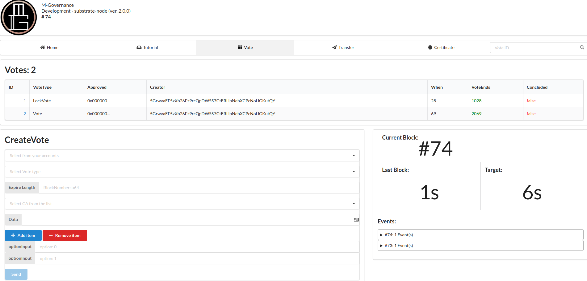
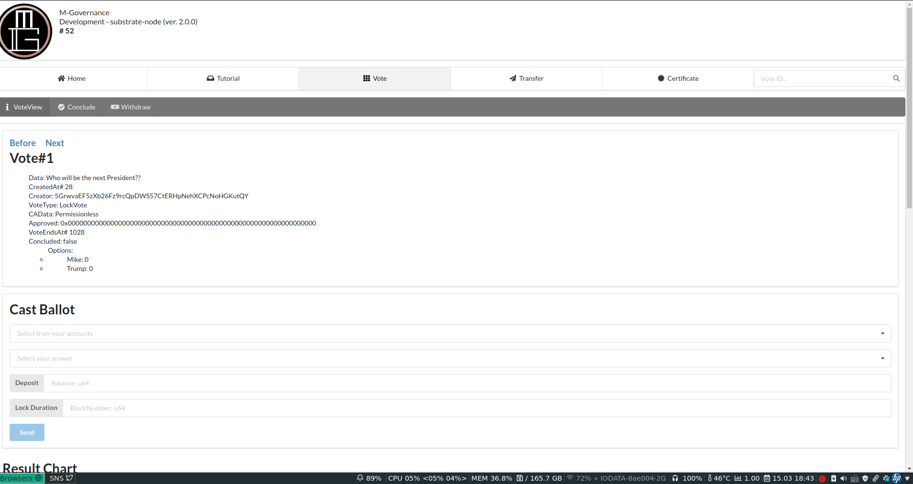

# M-Governance-UI

## TestNet Deployed  [Here](https://apps.m-governance.org/)

This is a basic frontend UI to interact with M-Governance runtime module.
To play with the DApp, pleaze clone this repo, then:

```bash
cd ./m-governance-ui
npm install;
yarn;
yarn start;
```

### Sample Images
#### Home Screen


#### Create a Vote


#### Cast a Ballot


### Identity System
You can register any Central Authority PEM file, for later use in permitted Vote where only accounts with cryptographically correct signature can cast a ballot.
To read digital certificates from your keychain or Smartcard, install [Fortify App](https://fortifyapp.com/). 
